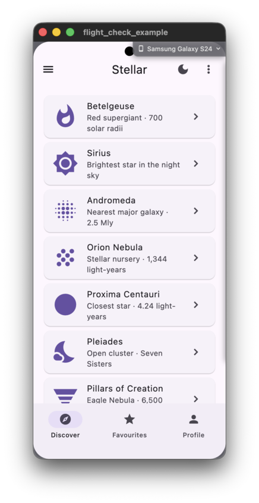
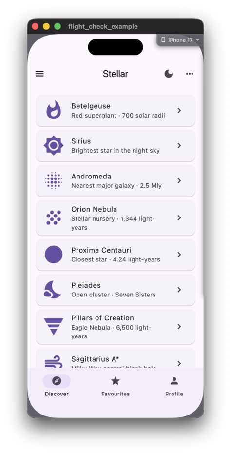
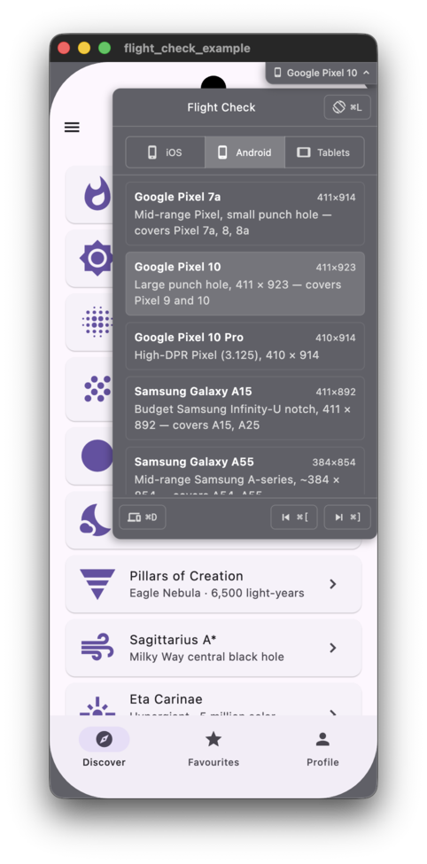

# Flight Check

Flight Check is a development time tool for Flutter that lets you preview your
app across different mobile device profiles — so you'll know what it looks like
without guesswork.

We support a broad range of device profiles covering common screen sizes, device
types, and notch type and safe areas sizes.

We use binding-layer emulation, so `MediaQuery` and safe areas report what a
real device would. And Flight Check is tree-shaken out in release mode, so you
don't ship any unnecessary code.

## Getting started

Add `flight_check` as a regular dependency:

```
flutter pub add flight_check
```

In your `main.dart`, call `FlightCheck.configure()` (**before** `runApp`):

```dart
import 'package:flight_check/flight_check.dart';

void main() {
  FlightCheck.configure();

  runApp(const MyApp());
}
```

Then run your app as Flutter Desktop app on macOS, Linux, or Windows; the
preview UI appears automatically. You can even leave the call in
unconditionally; Flight Check is tree-shaken out at compile time for release
builds.

- **Release / profile builds** — tree-shaken out at compile time
- **iOS / Android devices** — skipped at runtime so real-device debug sessions
  are unaffected
- **Flutter Web** — excluded via a conditional import

## Supported devices

| Device | Size | Device category |
| --- | --- | --- |
| iPhone SE (3rd gen) | 375 × 667 | Flat-edge, no cutout, small screen — budget / upgrade path |
| iPhone 14 | 390 × 844 | Notch, 390 × 844 — covers iPhone 12, 13, 14 |
| iPhone 15 | 393 × 852 | Dynamic Island, 393 × 852 — proxy for iPhone 14 Pro, 15 Pro, 16, 16e |
| iPhone 15 Pro Max | 430 × 932 | Dynamic Island, 430 × 932 — covers iPhone 15 Plus, 16 Plus |
| iPhone 17 | 402 × 874 | Current standard iPhone, 402 × 874 — same geometry as iPhone 17 Pro |
| iPhone 17 Air | 420 × 912 | Dynamic Island, 420 × 912 — iPhone 17 Air |
| iPhone 17 Pro | 402 × 874 | Dynamic Island, 402 × 874 — covers iPhone 16 Pro, 17 Pro |
| iPhone 17 Pro Max | 440 × 956 | Largest iPhone screen, 440 × 956 |

| Device | Size | Device category |
| --- | --- | --- |
| Google Pixel 7a | 411 × 914 | Mid-range Pixel, small punch hole — covers Pixel 7a, 8, 8a |
| Google Pixel 10 | 411 × 923 | Large punch hole, 411 × 923 — covers Pixel 9 and 10 |
| Google Pixel 10 Pro | 410 × 914 | High-DPR Pixel (3.125), 410 × 914 |
| Samsung Galaxy A15 | 411 × 892 | Budget Samsung Infinity-U notch, 411 × 892 — covers A15, A25 |
| Samsung Galaxy A55 | 384 × 854 | Mid-range Samsung A-series, ~384 × 854 — covers A54, A55 |
| Samsung Galaxy S24 | 360 × 780 | Flagship Samsung, 360 × 780 — covers S23, S24 |

| Device | Size | Device category |
| --- | --- | --- |
| iPad mini (A17 Pro) | 744 × 1133 | Compact iPad, 744 × 1133 |
| iPad (A16) | 820 × 1180 | Standard iPad, 820 × 1180 |

### Screenshots

| Galaxy S24 | iPhone 17 | Pixel 10 |
|:---------:|:--------:|:----------:|
|  |  |  |

## Calling WidgetsFlutterBinding.ensureInitialized()?

If your app calls `WidgetsFlutterBinding.ensureInitialized()`, place the call to
`FlightCheck.configure()` before the `WidgetsFlutterBinding` call.

## Known limitations

- Font hinting and sub-pixel rendering match the host display, not the emulated
  device.
- Platform plugins (maps, camera, webviews) receive spoofed `FlutterView`
  metrics but their native rendering surfaces are unaffected.
- Safe area insets are static per profile; dynamic changes such as keyboard
  appearance are not emulated.
- `MediaQuery.devicePixelRatio` reflects the derived window DPR rather than the
  device's nominal DPR; apps that branch on this value may behave differently
  than on a real device.
- `defaultTargetPlatform` is overridden to match the emulated device's platform,
  giving correct scroll physics, page transitions, and haptic feedback patterns;
  however, text-field keyboard shortcuts may not match the host keyboard when
  the host OS and emulated platform differ (e.g. Android on macOS)
- back-navigation assumptions (system back button on Android, swipe-back on iOS)
  cannot be satisfied on desktop
- Flutter Web is not supported.

## License

BSD 3-Clause — see [LICENSE](LICENSE).
